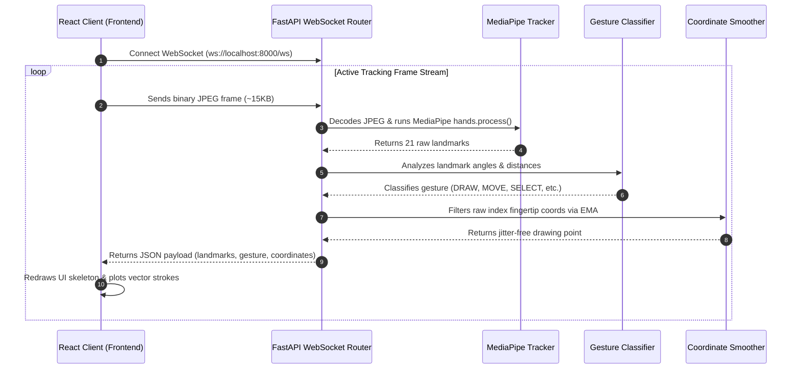

# System Architecture - AI Air Canvas Studio

This document explains the high-fidelity architecture, data flow, and algorithmic design of the AI Virtual Air Canvas web application.

---

## 1. System Overview

The system utilizes a client-server architecture:
- **Client (Frontend)**: A React-TypeScript SPA styled using Tailwind CSS and animated with Framer Motion. It captures the webcam feed, runs the canvas rendering loop (using double HTML5 canvases at 60 FPS), parses user settings, listens for Web Speech voice recognition transcripts, and handles user interactions.
- **Server (Backend)**: A FastAPI Python server. It receives JPEG compressed video frames from the client via WebSockets, processes them using MediaPipe Hands and OpenCV, smooths coordinates, and returns hand landmarks and classified gestures. It also provides REST endpoints for image and document exports (PNG, JPG, PDF, SVG) and processes handwriting OCR and shape auto-corrections.

---

## 2. Real-Time WebSocket Streaming & Flow Control

To prevent network congestion and backend overloading (which would cause lag and drop rendering below 30 FPS):
1. **Resolution Downscaling**: The client downscales the captured webcam frames to `640x480` before sending. Hand tracking does not benefit from higher resolutions, and 640x480 is MediaPipe's native internal tracking frame dimensions.
2. **JPEG Compression**: The frame is compressed to JPEG at `0.65` quality (averaging ~15KB per frame).
3. **Pipelined Flow Control**: The client runs a frame sender interval at 30 FPS (every 33ms). However, it uses an `isProcessing` lock flag. A new frame is only sent if `isProcessing` is false. When the backend sends back the coordinates response, `isProcessing` is reset to false. This ensures zero frame queue buildup, maintaining real-time responsiveness even on high-latency connections.

---

## 3. Gestures Mathematical Mapping

Gestures are identified geometrically from the 21 normalized landmarks ($L_0$ to $L_{20}$) returned by MediaPipe.

| Gesture | Real-world Hand Form | Heuristic Equations / Rules |
| :--- | :--- | :--- |
| **DRAW** | One Index Finger Extended | $Index_{open}$ AND NOT $Middle_{open}$ AND NOT $Ring_{open}$ AND NOT $Pinky_{open}$ |
| **MOVE_CURSOR** | Two Fingers Up (Closed) | $Index_{open}$ AND $Middle_{open}$ AND $\text{Dist}(L_8, L_{12}) < 0.07$ |
| **ERASER** | Peace Sign (Two Fingers Spread) | $Index_{open}$ AND $Middle_{open}$ AND $\text{Dist}(L_8, L_{12}) \ge 0.07$ |
| **SELECT** | Pinch (Index + Thumb) | $\text{Dist}(L_4, L_8) < 0.04$ |
| **PAUSE** | Open Palm | All fingers open (Index, Middle, Ring, Pinky, Thumb) |
| **SAVE** | Thumb Up | $Thumb_{open}$ AND $Thumb_{tip}.y < Thumb_{mcp}.y$ AND all other fingers closed |
| **CLEAR_CANVAS**| Closed Fist | All fingers closed |

---

## 4. Smart Processing Pipelines

### Shape Auto-correction
When a drawing stroke ends:
1. The client sends the raw point log (array of $\{x, y\}$ coordinates) to the `/api/detect_shape` WebSocket message.
2. The backend renders this path into a binary OpenCV mask and finds the outer contour.
3. It runs `cv2.approxPolyDP` using an adaptive epsilon:
   - **Line**: Start-to-end distance matches total path distance (>88%).
   - **Circle**: Circularity metric ($4\pi \cdot \text{Area} / \text{Perimeter}^2$) is close to $1.0$.
   - **Triangle**: Approximated vertices = 3.
   - **Rectangle/Square**: Vertices = 4. Aspect ratio distinguishes square vs rectangle.
   - **Star**: Bounding box solidity is low (<82%) and convexity defects count is 5.
   - **Arrow**: Vertices = 5-8, solidity is moderate, and start/end coordinates shape the shaft and arrowhead.
4. The perfected shape vertices are returned, and the client swaps the user's jagged line with the clean vector shape.

### Voice Commands
The React client uses the Web Speech API to translate the user's microphone audio into text transcripts locally, eliminating backend audio network overhead. The text is passed to the Python parser, which maps actions using regular expressions:
- `"color red"` $\rightarrow$ sets drawing color to `#ef4444`.
- `"use eraser"` $\rightarrow$ switches active tool to eraser.
- `"undo stroke"` $\rightarrow$ triggers the undo operation.

### Handwriting OCR
The client captures the drawing canvas as a base64 JPEG and transmits it to the backend. The backend pre-processes the canvas to black ink on a white background, crops out unused margins, and attempts to run local `pytesseract`. If Tesseract is not installed, it falls back to a public online API using `urllib` to ensure it runs out-of-the-box in all environments.
